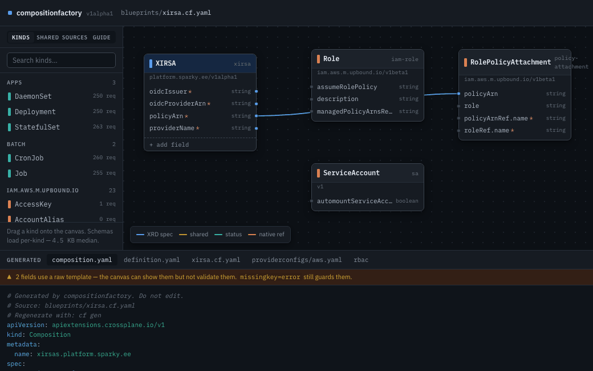

# composition-factory

[](https://github.com/koorikla/compositionfactory/actions/workflows/ci.yml)
[](https://github.com/koorikla/compositionfactory/releases)
[](LICENSE)
[](https://github.com/koorikla/compositionfactory/pkgs/container/compositionfactory)

**Schema-aware generator and visual canvas for Crossplane v2 Compositions and CompositeResourceDefinitions (XRDs).**

`cf` pulls CustomResourceDefinitions directly from provider package OCI layers (fetching only CRD metadata layers, never whole images). Every field in your blueprint is strictly validated against that CRD's real `spec.forProvider` OpenAPI schema at author/generate time — so typo'd field paths fail loudly with nearest-match suggestions instead of being silently pruned by the Kubernetes API server on apply.



One engine, `internal/emit`, powers all interfaces: the **`cf gen` CLI**, the **`cf serve` visual canvas**, and the **`cf mcp` AI agent server** produce 100% byte-identical, deterministic YAML ready for GitOps.

---

## Quickstart (Docker)

Run immediately from GitHub Container Registry — no Go toolchain or repository clone required:

**1. Create a blueprint in your current directory:**

```sh
cat <<'EOF' > xqueue.cf.yaml
apiVersion: factory.crossplane.io/v1alpha1
kind: Blueprint
metadata:
  name: xqueue
spec:
  sources:
    - provider: ghcr.io/crossplane-contrib/provider-aws-sqs:v2.7.0
  xrd:
    group: platform.sparky.ee
    kind: XQueue
    plural: xqueues
    version: v1alpha1
    scope: Namespaced
    parameters:
      location:       {type: string, required: true, enum: [EU, US]}
      providerName:   {type: string, required: true}
      maxMessageSize: {type: integer, default: "2048"}
  resources:
    - name: main-queue
      kind: Queue
      provider: ghcr.io/crossplane-contrib/provider-aws-sqs:v2.7.0
      fields:
        region:         {value: "eu-north-1"}
        maxMessageSize: {from: params.maxMessageSize}
EOF
```

**2. Cache provider CRD schemas:**

```sh
docker run --rm \
  -v "$(pwd)":/workspace \
  -v cf-cache:/home/cf/.cache/compositionfactory \
  ghcr.io/koorikla/compositionfactory:latest provider add ghcr.io/crossplane-contrib/provider-aws-sqs:v2.7.0
```

**3. Open the visual canvas:**

```sh
docker run --rm -p 8080:8080 \
  -v "$(pwd)":/workspace \
  -v cf-cache:/home/cf/.cache/compositionfactory \
  ghcr.io/koorikla/compositionfactory:latest serve --blueprint xqueue.cf.yaml --addr 0.0.0.0:8080 --i-know-this-is-unauthenticated
```

Open <http://localhost:8080> in your browser to interactively design and wire your composition.

**4. Generate production YAML:**

```sh
docker run --rm \
  -v "$(pwd)":/workspace \
  -v cf-cache:/home/cf/.cache/compositionfactory \
  ghcr.io/koorikla/compositionfactory:latest gen xqueue.cf.yaml -o out
```

---

## Quickstart (Local Binary)

**1. Build:**

```sh
make build          # -> bin/cf
```

**2. Add a provider schema:**

```sh
bin/cf provider add ghcr.io/crossplane-contrib/provider-aws-sqs:v2.7.0
```

**3. Generate output:**

```sh
bin/cf gen testdata/xqueue.cf.yaml -o out
# wrote out/compositions/xqueues.platform.sparky.ee.yaml
# wrote out/functions.yaml
# wrote out/xrds/xqueues.platform.sparky.ee.yaml
```

**4. Start the Canvas GUI:**

```sh
bin/cf serve --blueprint testdata/xqueue.cf.yaml --out out
```

Open <http://localhost:8080>.

**5. Verify with Crossplane CLI:**

```sh
crossplane composition render testdata/xr.yaml \
  out/compositions/xqueues.platform.sparky.ee.yaml \
  out/functions.yaml \
  --xrd out/xrds/xqueues.platform.sparky.ee.yaml
```

---

## Core Capabilities

- **Strict Schema Enforcement:** Checks field paths against the provider's CRDs and vendored Kubernetes OpenAPI schemas.
- **Interactive Visual Canvas:** Drag-and-drop resources, connect parameters with visual wires, view live diffs, and toggle light/dark themes.
- **Cross-Resource References:** Status wires (`resources.<name>.status.atProvider.<field>`) and reference wires with automatic conditional rendering.
- **Native Kubernetes Support:** Compose native `Deployment`, `Service`, `ConfigMap`, `Secret`, and `ServiceAccount` alongside cloud resources.
- **Deterministic GitOps Output:** Emits normalized YAML (LF line endings, sorted keys, header provenance comments) to prevent Git churn and ArgoCD sync loops.
- **MCP Server for AI Agents:** Full authoring and schema inspection support for LLMs and coding assistants. See [MCP Server Guide](docs/mcp.md).

---

## Blueprint DSL

A blueprint combines an XRD definition and composed resources into a single declarative file:

```yaml
apiVersion: factory.crossplane.io/v1alpha1
kind: Blueprint
metadata:
  name: xirsa
spec:
  sources:
    - provider: ghcr.io/crossplane-contrib/provider-aws-iam:v2.7.0
  xrd:
    group: platform.sparky.ee
    kind: XIRSA
    plural: xirsas
    version: v1alpha1
    scope: Namespaced
    parameters:
      providerName:    {type: string, required: true}
      policyArn:       {type: string, required: true}
      oidcIssuer:      {type: string, required: true}
      oidcProviderArn: {type: string, required: true}
  resources:
    - name: iam-role
      kind: Role
      provider: ghcr.io/crossplane-contrib/provider-aws-iam:v2.7.0
      fields:
        description:      {value: "IAM Role for Service Account"}
        assumeRolePolicy: {raw: '{"Version":"2012-10-17","Statement":[{"Effect":"Allow","Principal":{"Federated":"{{ $spec.oidcProviderArn }}"},"Action":"sts:AssumeRoleWithWebIdentity","Condition":{"StringEquals":{"{{ $spec.oidcIssuer }}:sub":"system:serviceaccount:{{ $xr.metadata.namespace }}:{{ $xr.metadata.name }}"}}}]}'}
    - name: policy-attachment
      kind: RolePolicyAttachment
      provider: ghcr.io/crossplane-contrib/provider-aws-iam:v2.7.0
      fields:
        policyArn: {from: params.policyArn}
        role:      {from: resources.iam-role.status.atProvider.id}
    - name: sa
      kind: ServiceAccount
      provider: k8s
      fields:
        automountServiceAccountToken: {raw: "true"}
```

### Field Modes

- **`value`**: Literal scalar value (emitted quoted for strings).
- **`from`**: Parameter or cross-resource reference (`params.<name>` or `resources.<name>.status.<field>`). Required parameters dereference directly; optional parameters are automatically wrapped in `hasKey` guards.
- **`raw`**: Verbatim template expression or complex JSON/YAML block.

### Flow Control

- **`forEach: params.<count>`**: Replicates a resource N times using Go template range with distinct indexed resource names.
- **`when: params.<bool>`**: Conditionally includes a resource based on a boolean parameter.

---

## CLI Commands

| Command | Description |
| :--- | :--- |
| `cf provider add <image>` | Pulls and caches CRD schemas from an OCI provider image into `.cf.lock`. |
| `cf gen <blueprint> -o <out>` | Generates Compositions, XRDs, and supporting manifests into the output directory. |
| `cf gen --check <blueprint>` | Checks if output matches blueprint without writing (exits 0 if in sync, 2 if drifted). |
| `cf serve --blueprint <file>` | Starts HTTP API and embedded canvas visual editor on `:8080`. |
| `cf mcp --blueprint <file>` | Runs MCP server over stdio for AI agent workflows. |

---

## Development

Requires Go 1.25+ and Node.js for Playwright e2e tests.

```sh
make build          # Build bin/cf
make test           # Run unit tests (no Docker required)
make test-docker    # Run acceptance tests with Docker + crossplane CLI
make test-e2e       # Run Playwright browser tests
make lint           # Check formatting and vet
```

---

## Documentation

- [MCP Server Guide](docs/mcp.md) — Registering and using `cf mcp` with Claude Code and other agent tools.
- [Provider Catalogue](docs/catalogue.md) — Curated list of popular Crossplane providers.

---

## License
 
This project is licensed under the [GNU Affero General Public License v3.0](LICENSE) (AGPL-3.0).
