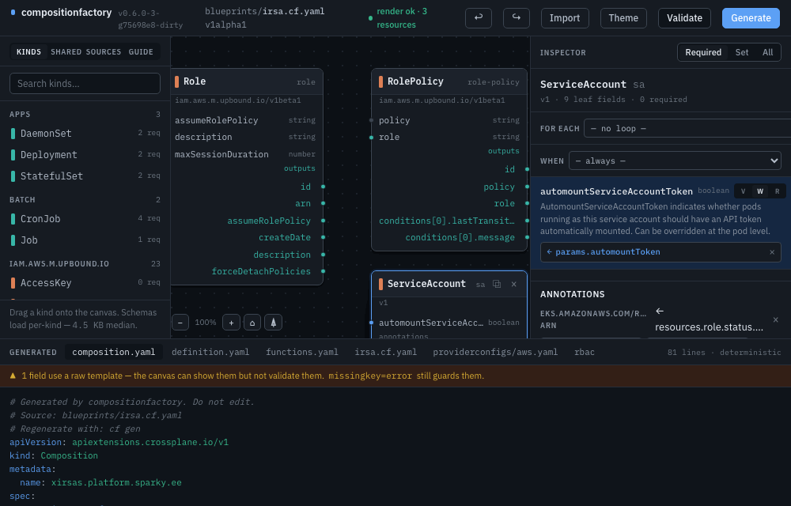
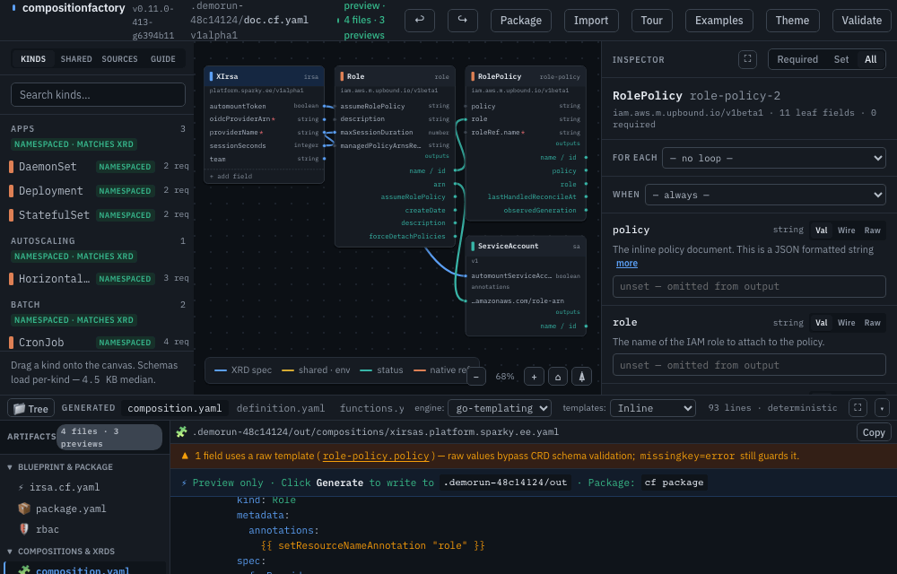
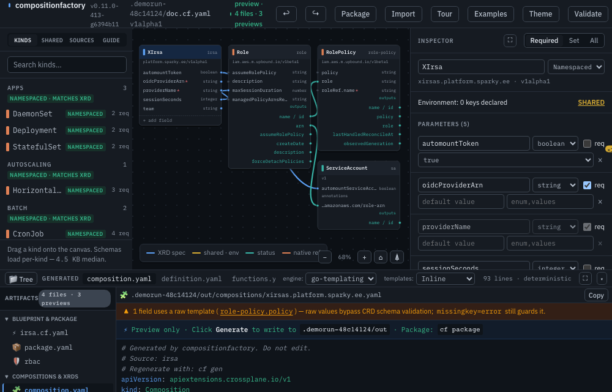
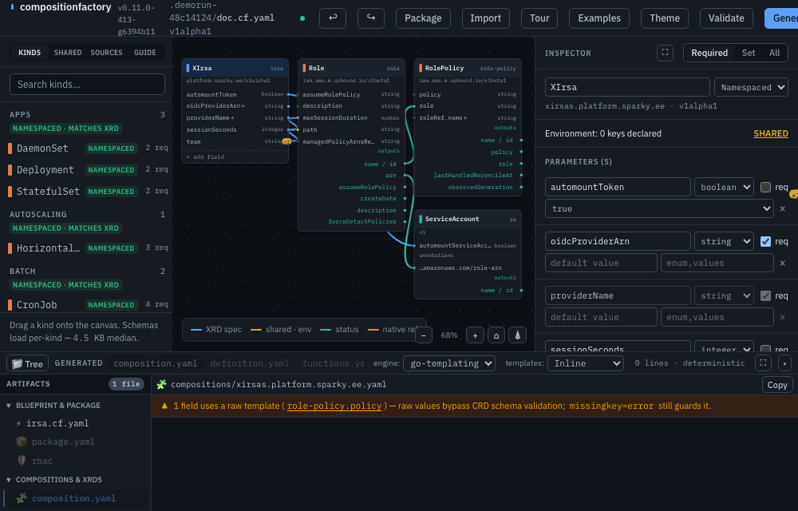
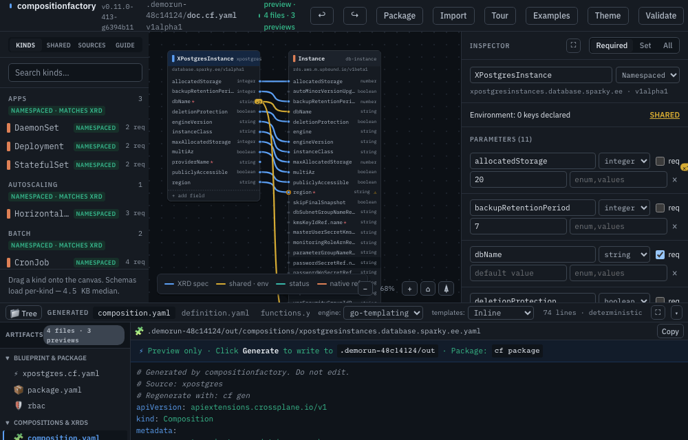
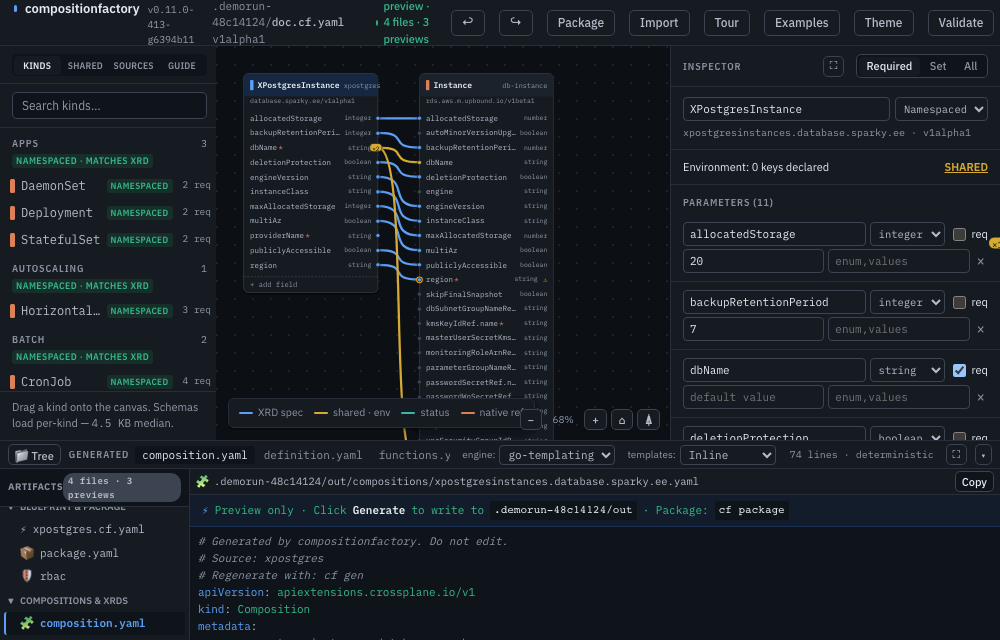
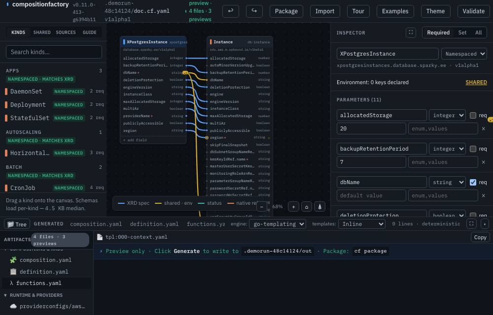

# composition-factory

[](https://github.com/koorikla/compositionfactory/actions/workflows/ci.yml)
[](https://github.com/koorikla/compositionfactory/releases)
[](LICENSE)
[](https://github.com/koorikla/compositionfactory/pkgs/container/compositionfactory)

**Schema-aware generator and visual canvas for Crossplane v2 Compositions and CompositeResourceDefinitions (XRDs).**

`cf` pulls CustomResourceDefinitions directly from provider package OCI layers (fetching only CRD metadata layers, never whole images). Every field in your blueprint is strictly validated against that CRD's real `spec.forProvider` OpenAPI schema at author/generate time — so typo'd field paths fail loudly with nearest-match suggestions instead of being silently pruned by the Kubernetes API server on apply.


*The opening IRSA example: the canvas lays the dependency tree left-to-right (the ServiceAccount cannot exist before its Role reports an ARN), the teal wire carries `status.atProvider.arn` into the `eks.amazonaws.com/role-arn` annotation, and **Validate** runs a real `crossplane composition render` — the chip reports the composed resource count.*

<table><tr>
<td width="50%">


<sub><b>Compose</b> — drag kinds from the schema palette; every field is validated against the provider CRD, and the generated Composition updates live below.</sub>

</td>
<td width="50%">


<sub><b>Discover</b> — search the built-in catalogue of 476 OSS providers (upjet families included), one click pulls the schemas into your palette.</sub>

</td>
</tr><tr>
<td width="50%">


<sub><b>Drag-to-Wire</b> — drag parameter dots onto resource cards; choose spec fields, envelope, or annotations with auto-guarded bindings.</sub>

</td>
<td width="50%">


<sub><b>Starter Blueprints</b> — launch and explore curated production composition templates (IRSA, RDS PostgreSQL, Full-Stack Microservice) in one click.</sub>

</td>
</tr><tr>
<td width="50%">


<sub><b>File Tree Explorer</b> — hierarchical navigation across Compositions, Definitions, Functions, RBAC, and template files in the output drawer.</sub>

</td>
<td width="50%">


<sub><b>KCL & Go-Templating</b> — real-time emission switcher for `function-kcl` (typed `KCLInput`, `oxr`, `ocds`) or `function-go-templating`.</sub>

</td>
</tr></table>



*Floating & Movable Panels — pop the Inspector or Code Editor into free-floating windows, drag them across large topologies, collapse to titlebars, and dock them back into place with keyboard shortcuts (`Ctrl+B`).*

One engine, `internal/emit`, powers all interfaces: the **`cf gen` CLI**, the **`cf serve` visual canvas**, and the **`cf mcp` AI agent server** produce 100% byte-identical, deterministic YAML ready for GitOps.

---

## Quickstart (Docker)

Run immediately from GitHub Container Registry — no Go toolchain or repository clone required:

**1. Create a blueprint in your current directory:**

```sh
cat <<'EOF' > xqueue.cf.yaml
apiVersion: factory.crossplane.io/v1alpha1
kind: Blueprint
metadata:
  name: xqueue
spec:
  sources:
    - provider: ghcr.io/crossplane-contrib/provider-aws-sqs:v2.7.0
  xrd:
    group: platform.sparky.ee
    kind: XQueue
    plural: xqueues
    version: v1alpha1
    scope: Namespaced
    parameters:
      location:       {type: string, required: true, enum: [EU, US]}
      providerName:   {type: string, required: true}
      maxMessageSize: {type: integer, default: "2048"}
  resources:
    - name: main-queue
      kind: Queue
      provider: ghcr.io/crossplane-contrib/provider-aws-sqs:v2.7.0
      fields:
        region:         {value: "eu-north-1"}
        maxMessageSize: {from: params.maxMessageSize}
EOF
```

**2. Cache provider CRD schemas:**

```sh
docker run --rm \
  -v "$(pwd)":/workspace \
  -v cf-cache:/home/cf/.cache/compositionfactory \
  ghcr.io/koorikla/compositionfactory:latest provider add ghcr.io/crossplane-contrib/provider-aws-sqs:v2.7.0
```

**3. Open the visual canvas:**

```sh
docker run --rm -p 8080:8080 \
  -v "$(pwd)":/workspace \
  -v cf-cache:/home/cf/.cache/compositionfactory \
  ghcr.io/koorikla/compositionfactory:latest serve --blueprint xqueue.cf.yaml --addr 0.0.0.0:8080 --i-know-this-is-unauthenticated
```

Open <http://localhost:8080> in your browser to interactively design and wire your composition.

**4. Generate production YAML:**

```sh
docker run --rm \
  -v "$(pwd)":/workspace \
  -v cf-cache:/home/cf/.cache/compositionfactory \
  ghcr.io/koorikla/compositionfactory:latest gen xqueue.cf.yaml -o out
```

---

## Quickstart (Local Binary)

**1. Build:**

```sh
make build          # -> bin/cf
```

**2. Add a provider schema:**

```sh
bin/cf provider add ghcr.io/crossplane-contrib/provider-aws-sqs:v2.7.0
```

**3. Generate output:**

```sh
bin/cf gen testdata/xqueue.cf.yaml -o out
# wrote out/compositions/xqueues.platform.sparky.ee.yaml
# wrote out/functions.yaml
# wrote out/xrds/xqueues.platform.sparky.ee.yaml
```

**4. Start the Canvas GUI:**

```sh
bin/cf serve --blueprint testdata/xqueue.cf.yaml --out out
```

Open <http://localhost:8080>.

**5. Verify with Crossplane CLI:**

```sh
crossplane composition render testdata/xr.yaml \
  out/compositions/xqueues.platform.sparky.ee.yaml \
  out/functions.yaml \
  --xrd out/xrds/xqueues.platform.sparky.ee.yaml
```

---

## Core Capabilities

- **Strict Schema Enforcement:** Field paths validate against the provider's real CRDs and vendored Kubernetes OpenAPI schemas — typos fail loudly with nearest-match suggestions, and the Required view shows *effective* requiredness (what you actually must set), not raw schema noise.
- **Interactive Visual Canvas:** Drag-and-drop resources, drag-to-wire parameters onto cards with a field picker, dependency-tree auto-layout (status consumers sit right of their sources), manual card resize, right-click menus, undo/redo, pan/zoom, a Guide tab, and slide-over panes on narrow screens.
- **Cross-Resource References:** Status wires (`resources.<name>.status.atProvider.<field>`) into fields *and* annotations (IRSA-style), with hasKey-guarded conditional rendering — an unobserved source omits the key cleanly, never `<no value>`.
- **Loops & Conditionals:** `forEach` over an integer parameter *or* a sibling's observed count (`resources.cluster.status.atProvider.nodeCount`), and `when:` conditions — all authorable from the inspector, all proven through real renders.
- **Reusable Templates & Conventions:** Named go-template blocks (`cf.tags`) applied by convention to every matching field, explicit values override; typed object parameters with member wiring (`params.tuning.retention`).
- **Native Kubernetes Support:** Compose native `Deployment`, `Service`, `ConfigMap`, `Secret`, and `ServiceAccount` alongside cloud resources.
- **Live Render Check:** The **Validate** button runs a real `crossplane composition render` against a sample XR synthesized from your XRD and reports the composed resource count or the engine's error verbatim.
- **Provider Discovery:** A built-in catalogue of 476 OSS providers (upjet families resolved to per-service packages) — search and one-click add; per-provider kind picker filters the palette; ProviderConfig scaffolds and an RBAC rule list generate alongside your compositions.
- **Live-Cluster Schema Source:** Point at a kind/k3s (or any) cluster to discover installed CRDs beyond packaged providers — strictly opt-in (`--cluster`/`--kubeconfig`).
- **Deterministic GitOps Output:** Emits normalized YAML (LF line endings, sorted keys, header provenance comments) to prevent Git churn and ArgoCD sync loops.
- **MCP Server for AI Agents:** Full authoring and schema inspection support for LLMs and coding assistants. See [MCP Server Guide](docs/mcp.md).

---

---

## Documentation

- 📘 **[Blueprint DSL Reference](docs/dsl.md)** — Specification for field modes (`value`, `from`, `raw`, `template`), cross-resource status wires, loops (`forEach`), conditionals (`when`), and envelopes.
- 🛠️ **[CLI & GitOps Guide](docs/cli.md)** — Detailed manual for `cf gen`, `cf serve`, `cf package`, `cf push`, `cf provider`, drift checks (`--check`), and CI/CD pipelines.
- 🎨 **[Canvas & User Guide](docs/guide.md)** — Visual canvas manual, wire color systems, gestures, keyboard shortcuts, and starter blueprints.
- 🤖 **[MCP Server Guide](docs/mcp.md)** — Setting up `cf mcp` with Claude Code, Antigravity, and AI assistant workflows.
- 📦 **[Provider Catalogue](docs/catalogue.md)** — Curated list of 476+ installable OSS Crossplane packages and upjet families.
- 🎥 **[Demo GIF Recorder](docs/record-demos.md)** — Headless recording harness for automated doc animations without ffmpeg.

---

## Development

Requires Go 1.25+ and Node.js for Playwright e2e tests.

```sh
make build          # Build bin/cf
make test           # Run unit tests (no Docker required)
make test-docker    # Run acceptance tests with Docker + crossplane CLI
make test-e2e       # Run Playwright browser tests
make lint           # Check formatting and vet
```

### Local Kubernetes with Skaffold

You can run Composition Factory inside a local Kubernetes cluster (Minikube, kind, k3d, Docker Desktop) with [Skaffold](https://skaffold.dev/):

```sh
skaffold dev        # Continuous build, deploy, sync, and port-forward
skaffold run        # One-shot deploy
```

---

## License
 
This project is licensed under the [GNU Affero General Public License v3.0](LICENSE) (AGPL-3.0).

