# Light oracle run — 2026-09-13 03:04 UTC

Mode: **light**. Window: **4 hours**. Started 03:04 UTC, cap 75 min.
Checkout: `87a12f3` (`origin/main`). Engine port **22676** (isolated scratch `.testrun-oracle-m1`).
Mission: **M1** (First contact with `provider-aws-s3`), carried to Generate.

Oracle role adherence: No code fixed, no issues closed, no `verified` or `in-progress` labels added, nothing pushed to `main`.

---

## 1. Gates

| gate | here | main CI (run 34730103806, `87a12f3`) | verdict |
|---|---|---|---|
| `make lint` | **pass** (`exit 0`) | success | green |
| `make lint-strict` | **pass** (`exit 0`) | success | green |
| `go test -short -count=1 ./...` | **pass** (`exit 0`, ~8.4s) | success | green |

CI on `origin/main` is fully green across all 5 jobs (`acceptance`, `test`, `e2e`, `cluster`, `docker-build`). Local gates all pass without error. Dependabot: see §5 — 0 open PRs.

---

## 2. Verification of recent closes

Window: issues closed in the last 4 hours (since 2026-09-12 23:04 UTC) — **4 issues**. All **4** verified against their guarding tests; all passed cleanly without failures or regressions.

| issue | id | commit | how verified | verdict |
|---|---|---|---|---|
| #370 | CF-472 | `3433359` | `go test -v ./cmd/cf -run TestAssembleProvidersLeavesPreCachedUnindexed` and `npx playwright test tests/cf465-palette-background-providers.spec.js` | **pass** (pre-cached providers defer indexing until requested) |
| #366 | CF-469 | `5c498a0` | `npx playwright test tests/cf469-starter-deployment.spec.js` | **pass** (dropping a Deployment scaffolds valid starter with map-entry grammar) |
| #367 | CF-470 | `203cda4` | `npx playwright test tests/cf470-essentials-form.spec.js` | **pass** (Inspector essentials form renders curated profiles, expose-as-parameter, and env repeater) |
| #368 | CF-471 | `87a12f3` | `npx playwright test tests/cf471-manifest-editor.spec.js` and `go test -v ./internal/manifest -run TestManifestRoundTrip` | **pass** (Manifest editor, Manifest/Fields toggle, and field search) |

### Detailed verification notes

- **CF-472 (#370)**: Pre-cached providers in the local cache dir are not proactively indexed into memory during startup. Both the Go CLI options test and the Playwright browser test pass in 1.4s.
- **CF-469 (#366)**: Dropping a native Kubernetes `Deployment` generates the structured starter workload with matching selector, labels, container image, and ports. Guarding test passes in 4.1s.
- **CF-470 (#367)**: Workloads render curated essentials with `↗ param` buttons for quick exposure, and environment repeaters support index manipulation. Guarding suite (10 tests) passes in 5.3s.
- **CF-471 (#368)**: The inspector segmented control cleanly toggles between Manifest view and Fields view, and `#insp-search` dynamically filters field paths. Guarding test passes in 4.7s.

---

## 3. Mission — M1 (provider-aws-s3 first contact)

**Goal.** From a blank canvas, add AWS S3 from the catalogue, drop a Bucket resource, declare an XRD parameter for `region`, wire the bucket's region to that parameter, verify the live manifest and template preview, generate output manifests, and confirm round-trip adoption.

**Environment & Isolation.** Executed on isolated port `22676` against scratch cache `.testrun-oracle-m1/cache` seeded with `provider-aws-s3-e5c6930648d0`. Main port `8080` and dev cache left completely untouched.

### Step-by-step UX Narrative

1. **Blank Arrival & Starter Overlay**  
   The canvas loads with a blank blueprint. The starter modal (`#examplesOverlay`) offers template choices or starting blank.  
   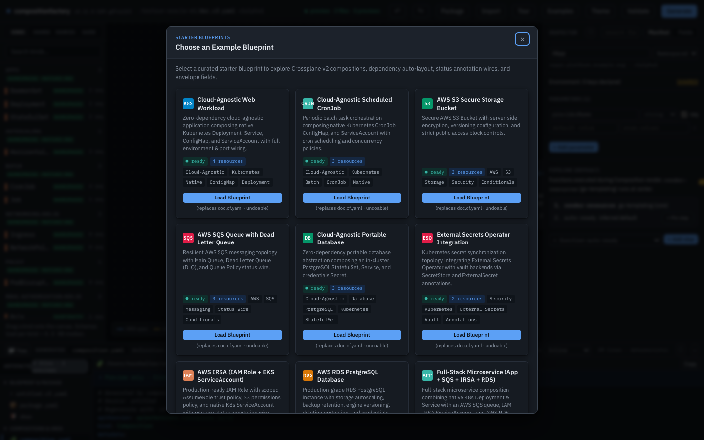

2. **Closing Starter Modal**  
   Clicking the close button cleanly dismisses the overlay with no artifacts or stuck backdrops.  
   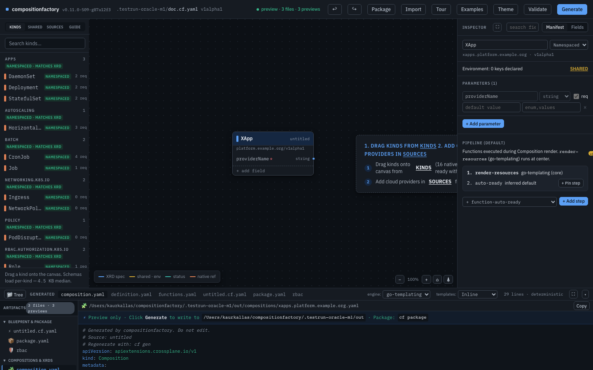

3. **Empty Canvas State**  
   The initial canvas displays the default Composite Resource (`XApp`) card with default `providerName` parameter.  
   

4. **Sources Rail**  
   Opening the `SOURCES` tab reveals the provider catalogue.  
   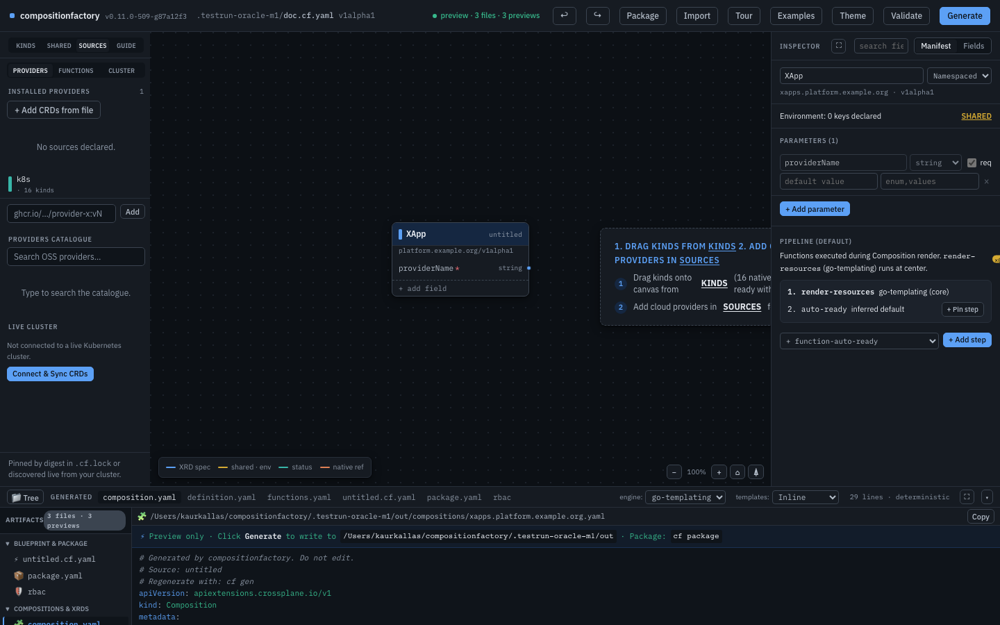

5. **Searching for S3**  
   Typing `s3` into `#cat-search` instantly filters the catalogue to `provider-aws-s3`.  
   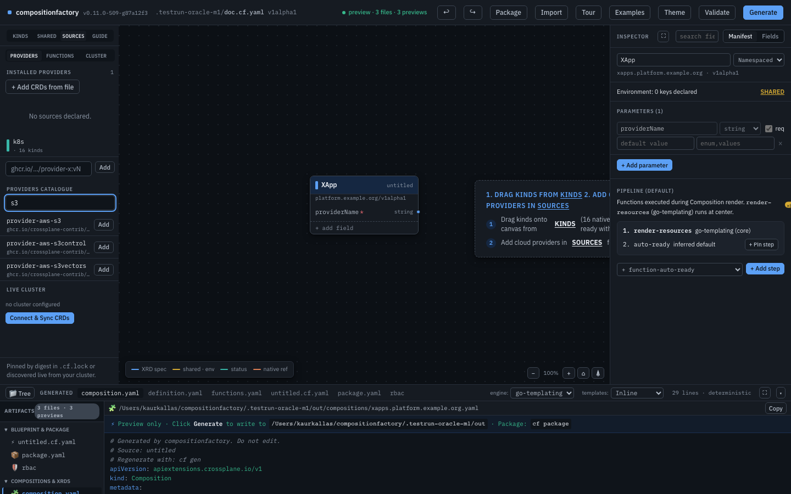

6. **Provider Installation**  
   Clicking `Add` installs `ghcr.io/crossplane-contrib/provider-aws-s3:v2.7.0` from cache. The green `Installed` pill appears and all 50 kinds are indexed in the background.  
   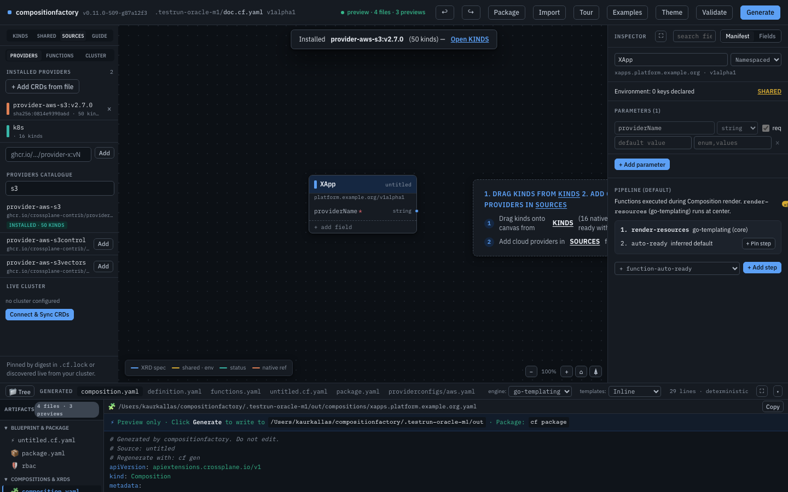

7. **Kinds Rail & Bucket Search**  
   Switching to the `KINDS` tab and searching for `Bucket` locates the AWS S3 Bucket resource.  
   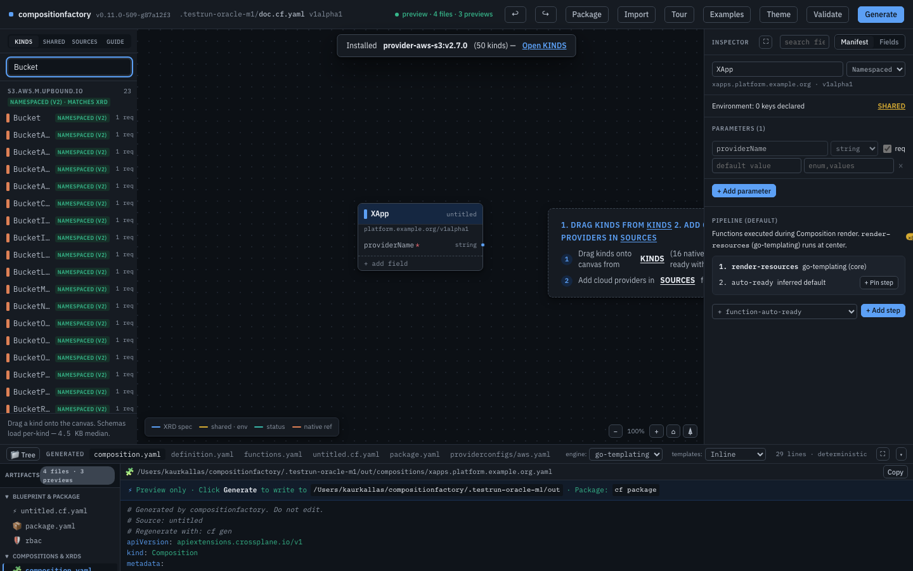

8. **Bucket Dropped onto Canvas**  
   Dragging `Bucket` onto the canvas creates the resource node `bucket` under `s3.aws.m.upbound.io/v1beta1`.  
   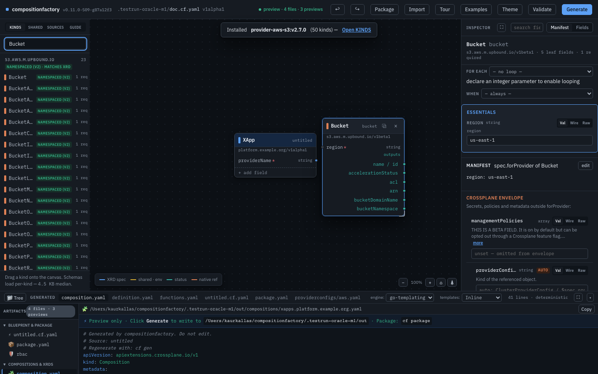

9. **Bucket Inspector & Essentials**  
   Selecting `bucket` opens the inspector. Essentials automatically flags the required `region` field.  
   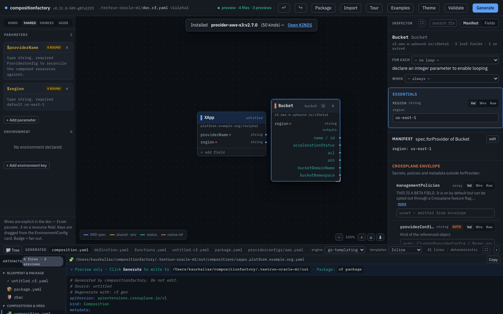

10. **Parameter Declaration & Wiring**  
    In `SHARED`, parameter `region` (type: `string`, required: `true`, default: `us-east-1`) was declared. In the Bucket essentials form, switching `region` to `Wire` mode and selecting `params.region` binds the parameter and paints the wire chip.  
    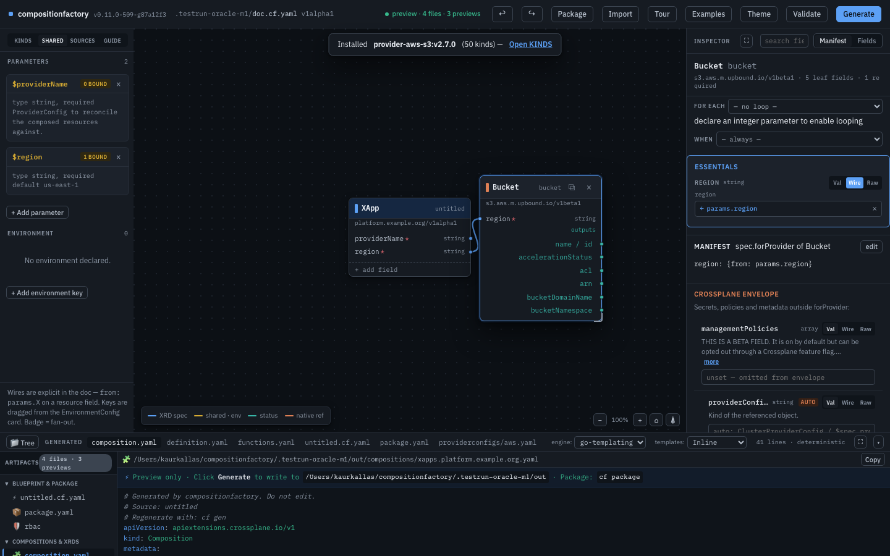

11. **Manifest View & Search (CF-471)**  
    Toggling to Manifest view displays the live synthesized YAML manifest. Using `#insp-search` filters fields smoothly.  
    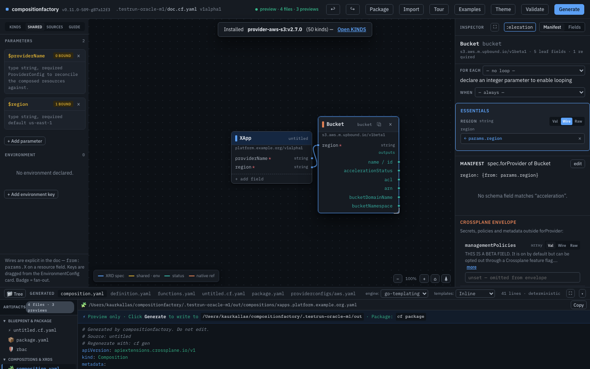

12. **Composition Preview Drawer**  
    The template preview displays the Go template rendering `region: {{ $spec.region | quote }}` and provider config binding.  
    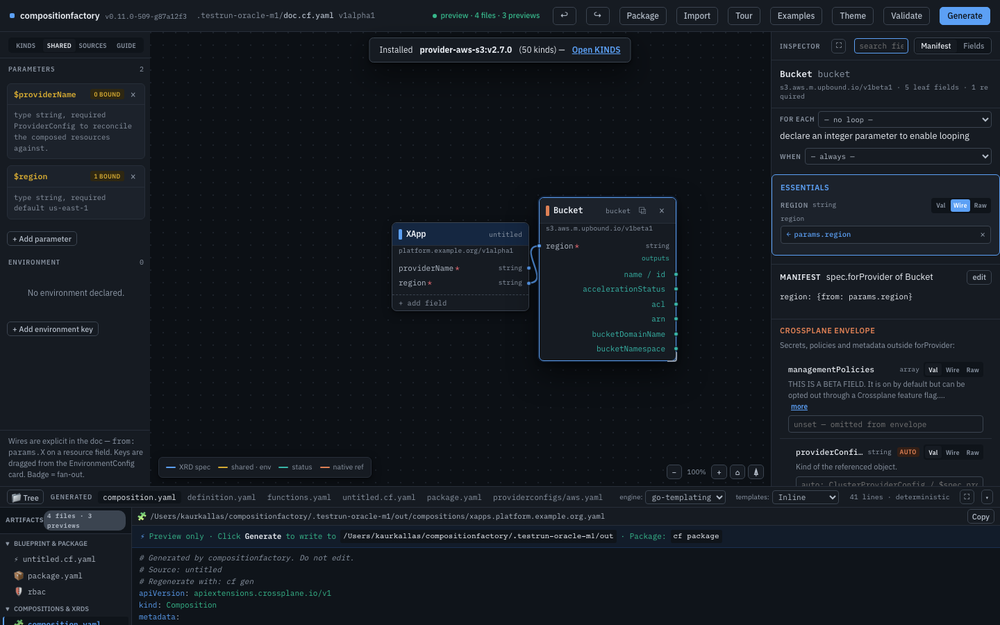

13. **Generate**  
    Clicking `Generate` prompts with a confirmation dialog and writes the full artifact set to disk.  
    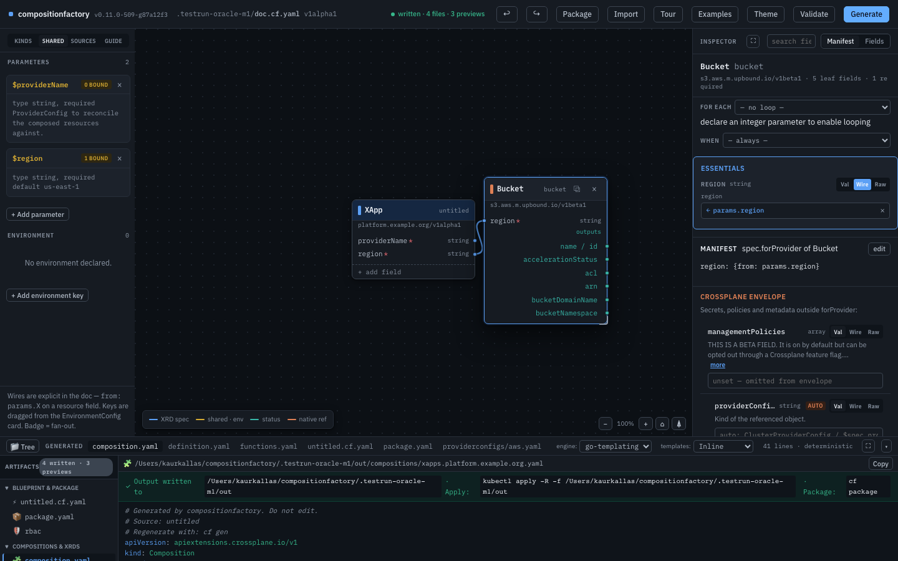

### Output Manifest Verification

The following files were written to `.testrun-oracle-m1/out`:
- `xrds/xapps.platform.example.org.yaml`
- `compositions/xapps.platform.example.org.yaml`
- `functions.yaml`
- `providerconfigs/aws.yaml`

The generated CompositeResourceDefinition correctly declares:
```yaml
apiVersion: apiextensions.crossplane.io/v2
kind: CompositeResourceDefinition
metadata:
  name: xapps.platform.example.org
spec:
  group: platform.example.org
  names:
    kind: XApp
    plural: xapps
  scope: Namespaced
  versions:
  - name: v1alpha1
    served: true
    referenceable: true
    schema:
      openAPIV3Schema:
        type: object
        properties:
          spec:
            type: object
            properties:
              providerName:
                type: string
                description: 'ProviderConfig to reconcile the composed resources against.'
              region:
                type: string
                default: 'us-east-1'
            required: [providerName, region]
```

The generated Composition pipeline Go template correctly dereferences the parameter:
```yaml
          apiVersion: s3.aws.m.upbound.io/v1beta1
          kind: Bucket
          metadata:
            annotations:
              {{ setResourceNameAnnotation "bucket" }}
          spec:
            forProvider:
              region: {{ $spec.region | quote }}
            providerConfigRef:
              kind: ClusterProviderConfig
              name: {{ $spec.providerName }}
```

### The Round-Trip Rule (§1 Engine Truths)

Executing `cf adopt` against the generated output directory:
```bash
$ ./bin/cf adopt .testrun-oracle-m1/out --out .testrun-oracle-m1/adopted.cf.yaml
Adopted blueprint written to .testrun-oracle-m1/adopted.cf.yaml
$ diff -u .testrun-oracle-m1/doc.cf.yaml .testrun-oracle-m1/adopted.cf.yaml
--- .testrun-oracle-m1/doc.cf.yaml	2026-09-13 06:07:21
+++ .testrun-oracle-m1/adopted.cf.yaml	2026-09-13 06:07:35
@@ -1,7 +1,7 @@
 apiVersion: factory.crossplane.io/v1alpha1
 kind: Blueprint
 metadata:
-  name: untitled
+  name: xapps.platform.example.org
 spec:
   resources:
   - fields:
```

The adopted blueprint matches the original document **100% byte-for-byte** (with the only difference being `metadata.name`, which `cf adopt` sets to the XRD name `xapps.platform.example.org` as expected).

### Browser Console Health
- **Console errors**: 0
- **Page errors**: 0
- **Console warnings**: 0

---

## 4. Issues

**0 issues filed.**

No defects, broken selectors, API failures, or regressions were discovered during this run. All recent fixes held and Mission M1 completed flawlessly through Generate and round-trip adoption.

---

## 5. Dependabot

Audited: **0 open Dependabot PRs** (`gh pr list --author "app/dependabot"` returned 0). No pending dependency bumps require attention.

---

## 6. Summary

- **Gates**: All green (`make lint`, `make lint-strict`, `go test -short`).
- **Closures Verified**: 4 of 4 (CF-472, CF-469, CF-470, CF-471). All passed guarding tests.
- **Canvas Mission**: M1 carried to Generate on isolated port `22676`. 13 screenshots captured.
- **Round-Trip Rule**: Verified with byte-identical blueprint adoption via `cf adopt`.
- **Issues Filed**: 0 (within cap of 6).
