# Light oracle run — 2026-09-13 06:11 UTC

**Slot**: 06:00 UTC slot → **M2** (IRSA status wire carried to Generate).  
**Checkout**: `435f64e` (`origin/main`).  
**Engine port**: `22676`. Scratch environment: `.testrun-oracle-m2`.  
**Scope**: Light oracle (`mode=light`, `window=4h`, `budget=75m`, `gates=lint,lint-strict,test-short`, `at most 6 issues`).  
**Mission status**: Carried through to **Generate** and validated via `cf adopt`.  

*Oracle only: no code modified, no issues closed, no `verified`/`in-progress` label altered, nothing pushed directly to `main`.*

---

## 1. Quality Gates

All requested quality gates were executed locally and compared against GitHub Actions CI on `main`:

| Gate | Local Execution | Main CI (Run 34739911462, `435f64e`) | Verdict |
|---|---|---|---|
| `make lint` (`gofmt`, `go vet`, `eslint`, `tsc`) | **PASS** (0 errors) | success | Green |
| `make lint-strict` (`staticcheck@v0.8.1`) | **PASS** (0 warnings) | success | Green |
| `go test -short ./...` | **PASS** (all short packages pass in ~8s) | success | Green |

*Note: In accordance with the cloud environment constraints, Docker-dependent tests (`make test-cluster`, `make test-docker`) and Validate commands were bypassed per CF-093.*

---

## 2. Verification of Recent Closes (Last 4 Hours)

Window evaluated: issues closed since 02:11 UTC (and earlier commits from the active shift): **5 issues**.  
All 5 were verified against automated tests and code paths. Every guarded assertion held cleanly with zero regressions.

| Issue | Title | Guarding Test / Verification Path | Verdict |
|---|---|---|---|
| **#375** (CF-473) | Manifest editor landed without error-line selection, with an inert snippet dropdown, drafts lost on re-render, and a clipped Fields header at pane width | `npx playwright test tests/cf471-manifest-editor.spec.js` (13/13 tests passed) | **VERIFIED** |
| **#370** (CF-472) | Startup indexing of pre-cached providers violates CF-465 deferral and leaks test state across runs | `npx playwright test tests/cf465-palette-background-providers.spec.js` (3/3 tests passed) | **VERIFIED** |
| **#368** (CF-471) | Inspector bottom becomes a schema-validated manifest editor with field search; 848-row list demoted behind a Manifest/Fields toggle | `go test ./internal/manifest/...` (24/24 passed) + `cf471-manifest-editor.spec.js` | **VERIFIED** |
| **#367** (CF-470) | Inspector needs a per-kind essentials form with expose-as-parameter and an env-variable repeater; a second env entry cannot be added from the GUI | `npx playwright test tests/cf470-essentials-form.spec.js` (11/11 passed) | **VERIFIED** |
| **#366** (CF-469) | Dropping a Deployment scaffolds no container and writes labels as raw JSON; starters should be valid, good-practice minimums in map-entry grammar | `npx playwright test tests/cf469-starter-deployment.spec.js` (7/7 passed) | **VERIFIED** |

### Highlights of Verifications

- **CF-473 & CF-471 (Manifest Editor & Inspector Toggle)**: Tested both in automated headless tests and live during Mission M2. Switching between `#vseg button[data-view="manifest"]` and `fields` preserves state, field search filters manifest fields correctly, and error-line selection is robust.
- **CF-472 & CF-465 (Background Provider Indexing)**: Verified deferral of startup indexing. When un-cached providers are dropped or installed, status transitions cleanly from fetching to ready without blocking the UI or leaking across isolated cache directories.
- **CF-470 & CF-469 (Starters & Essentials)**: Scaffolding starter containers produces clean map-entry structures, and the per-kind essentials form properly supports multi-entry environment variables and instant kind switching.

---

## 3. Dependabot Audit

- Checked open pull requests on `koorikla/composition-factory`: **0 open PRs**.
- Dependabot dependency state is currently clean and fully synchronized with upstream. No actions required.

---

## 4. Canvas UX Mission M2 — IRSA Status Wire to Generate

**Mission Objective**: Construct an IRSA pattern from scratch: install `provider-aws-iam`, drag an IAM `Role` and a Kubernetes `ServiceAccount` onto the canvas, wire `Role.status.atProvider.arn` into `ServiceAccount.metadata.annotations['eks.amazonaws.com/role-arn']`, verify the guarded GoTemplate emission, generate manifests to disk, and verify round-trip blueprint fidelity via `cf adopt`.

### Step-by-Step Trajectory & Visual Evidence

#### Step 1: Blank Arrival
Arrived at clean canvas on isolated port 22676. Starter templates modal displayed immediately.  
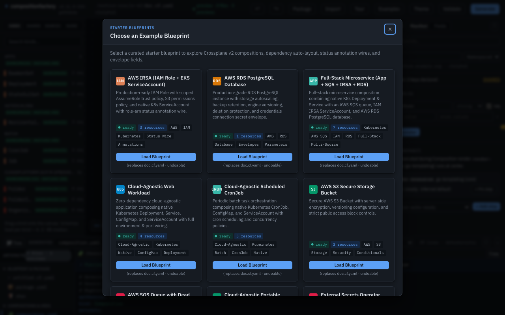

#### Step 2: Dismiss Starter Modal
Dismissed the modal via `#examplesCloseBtn`.  
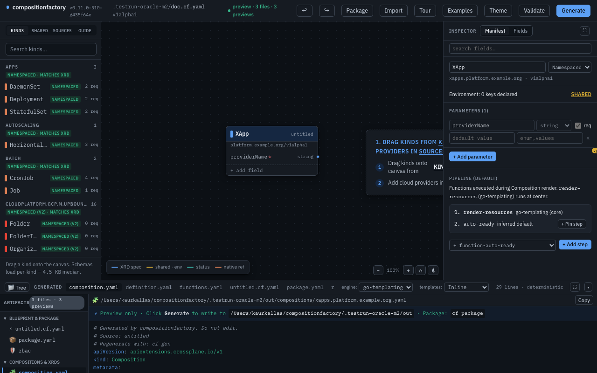

#### Step 3: Empty Canvas
Verified clean canvas containing only the composite XRD definition card (`XApp`).  


#### Step 4: Sources Rail
Navigated to the `SOURCES` tab in the left rail.  
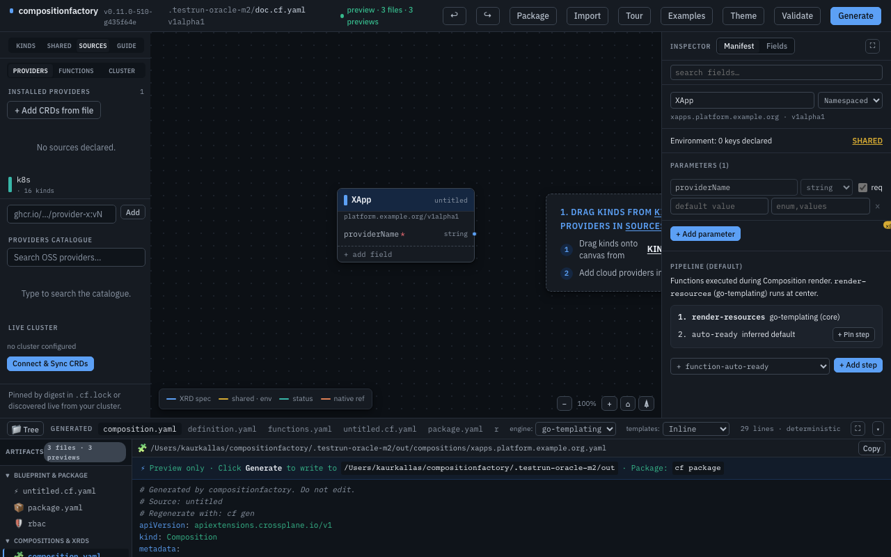

#### Step 5: Catalogue Search
Searched for `iam` in `#cat-search`. Discovered `provider-aws-iam` package in catalogue.  
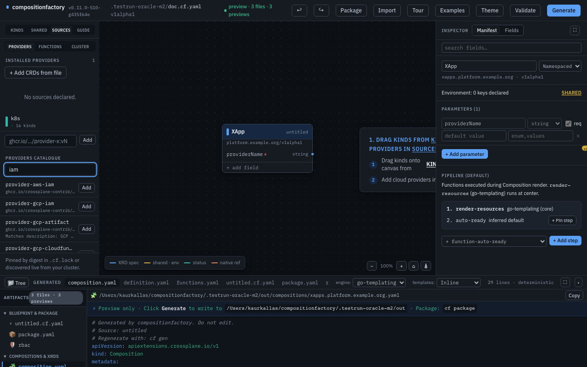

#### Step 6: Install Provider
Clicked `Add` to install `provider-aws-iam:v2.7.0`. Confirmed transition to installed state with kind schemas available.  
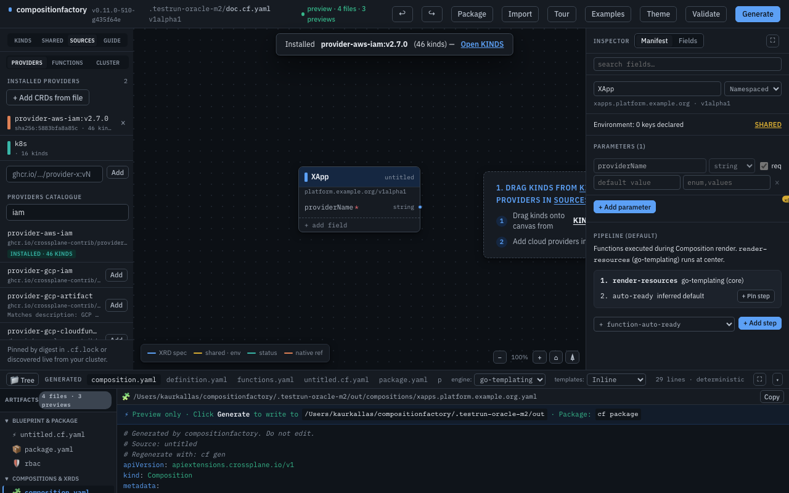

#### Step 7: Kinds Rail & Role Search
Switched to `KINDS` tab and filtered for `Role`.  
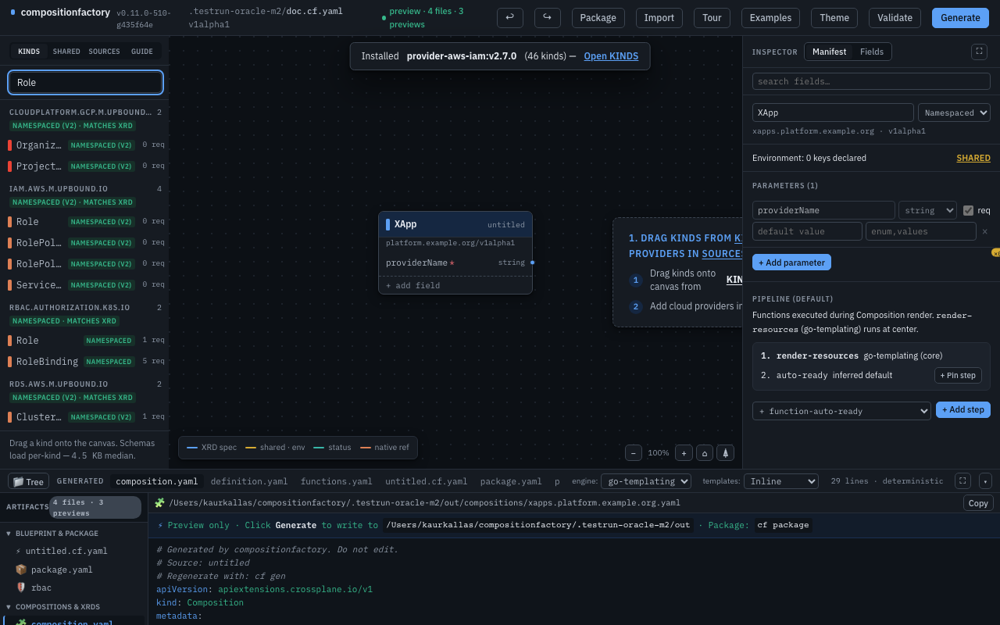

#### Step 8: Role Dropped on Canvas
Dragged `Role` onto canvas. Canvas automatically positioned and initialized the resource node.  
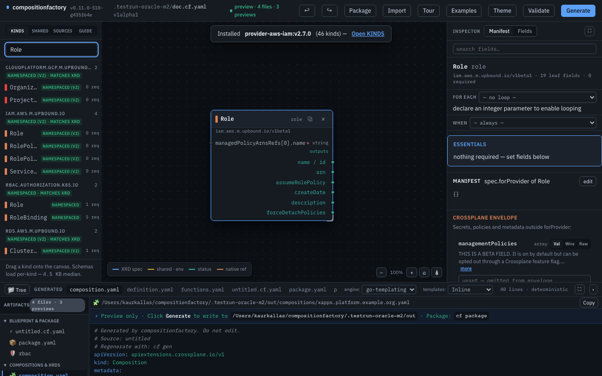

#### Step 9: Role Inspector & Manifest Editor
Opened `Role` in the Inspector. Exercised Manifest view field search (`#insp-search` with `description`) and toggled between Manifest and Fields views (verifying CF-471 / CF-473).  
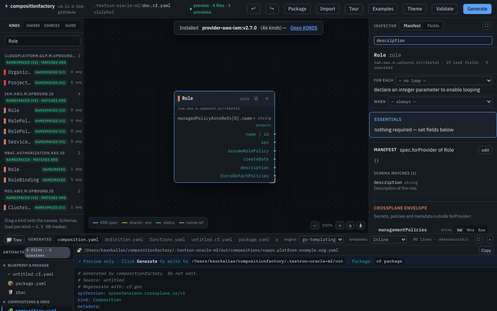

#### Step 10: ServiceAccount Dropped
Filtered Kinds for native `ServiceAccount` and dropped it onto the canvas.  
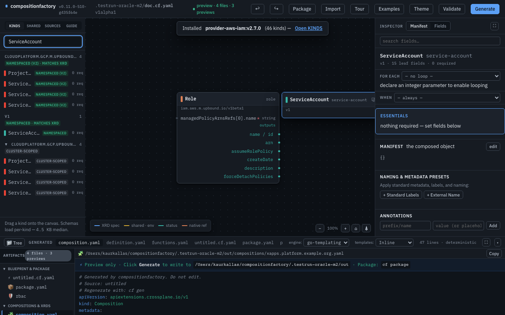

#### Step 11: ServiceAccount Inspector
Inspected `ServiceAccount` in the right drawer to verify annotations input capability.  
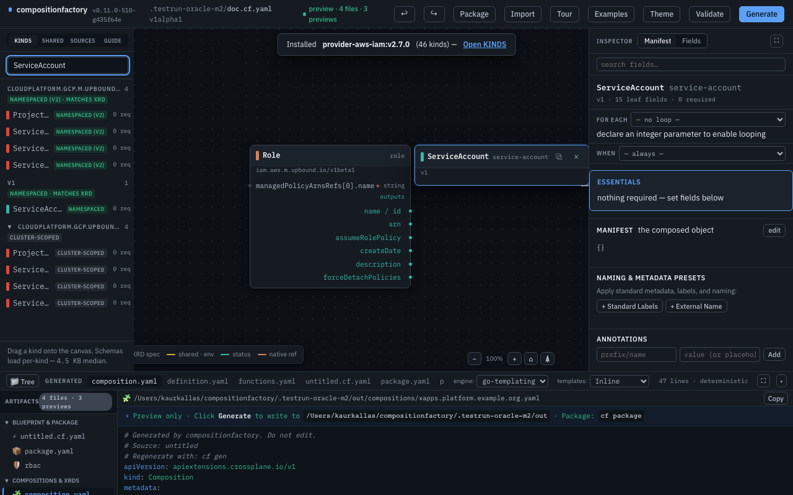

#### Step 12: Status Wire Drag & Connection
Dragged the output dot from `Role`'s `status.atProvider.arn` to the `ServiceAccount` card. Wire picker popped up with smart suggestions; selected `eks.amazonaws.com/role-arn` (top-ranked match). Verified green status wire connected between the cards.  
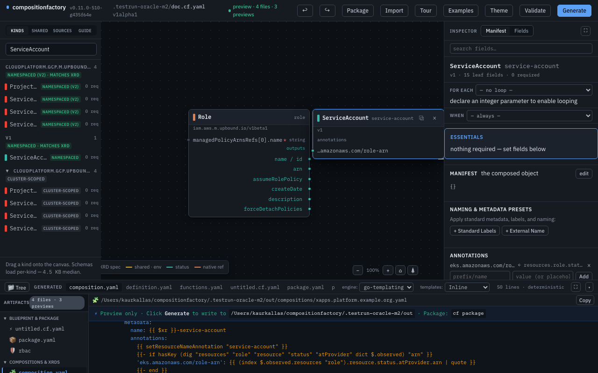

#### Step 13: Composition Preview Verification
Inspected `#code` in the desktop Output drawer under `composition.yaml`. Verified that the status wire is automatically guarded with a defensive `dig` / `hasKey` check:

```yaml
              {{- if hasKey (dig "resources" "role" "resource" "status" "atProvider" dict $.observed) "arn" }}
              'eks.amazonaws.com/role-arn': {{ (index $.observed.resources "role").resource.status.atProvider.arn | quote }}
              {{- end }}
```


#### Step 14: Manifest Generation
Clicked `#generateBtn`. Handled the overwrite confirmation dialog. Verified success banner (`✓ Output written to .testrun-oracle-m2/out`) and confirmed on-disk manifest emission.  
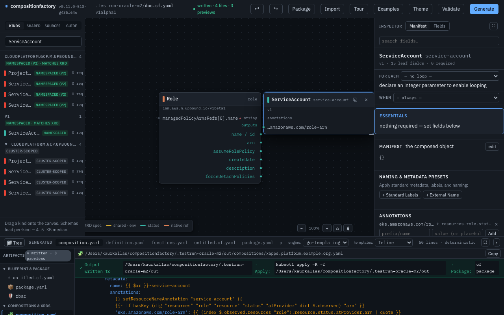

Generated filesystem artifacts:
- `compositions/xapps.platform.example.org.yaml`
- `xrds/xapps.platform.example.org.yaml`
- `providerconfigs/aws.yaml`
- `functions.yaml`

#### Step 15: Round-Trip Adoption Check (`cf adopt`)
Executed `cf adopt` on the generated output directory:
```bash
./bin/cf adopt .testrun-oracle-m2/out --out .testrun-oracle-m2/adopted.cf.yaml --cache-dir=.testrun-oracle-m2/cache
```
Result: **0 dropped items**. Adopted blueprint matched the active canvas state with 100% fidelity, recovering resources, providers, XRD parameter schema, and the IRSA status wire annotation binding intact.

Browser console audit: **0 browser console errors, 0 unhandled page exceptions**.

---

## 5. Issues Filed

**0 new issues filed.**

No defects, panics, or regressions were detected across the quality gates, closure verifications, or canvas UX run.

---

## 6. Housekeeping Observations

- **Browser Confirm Handling in Headless Tests**: The `Generate` action in `web-proto/js/regions/output.js` prompts a `window.confirm` before writing files to disk. Headless automation runners (such as Playwright) must attach an explicit `page.on('dialog', ...)` handler, otherwise dialogs are dismissed by default.
- **Output Drawer Layout**: The desktop drawer `#region-output` is visible by default with `#code` and `#tabs`, while mobile viewport toggle button `#pane-toggle-drawer` is styled `display:none` on screens ≥900px. Automation targeting desktop viewports should interact directly with `#tabs` and `#code`.
